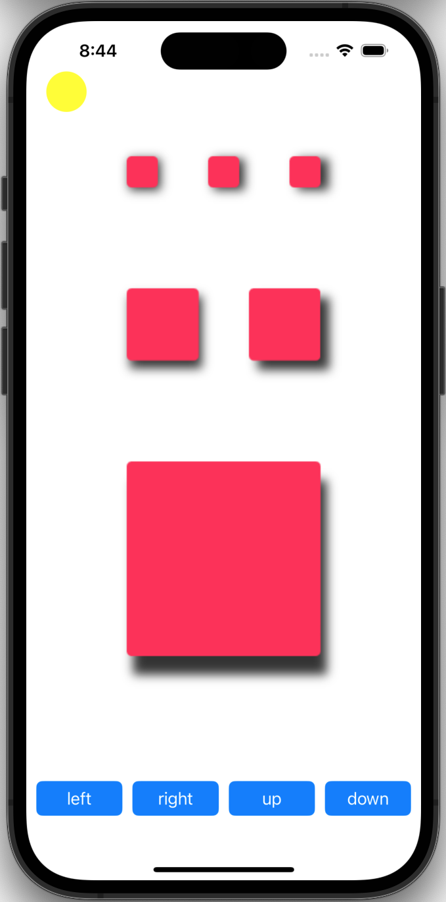
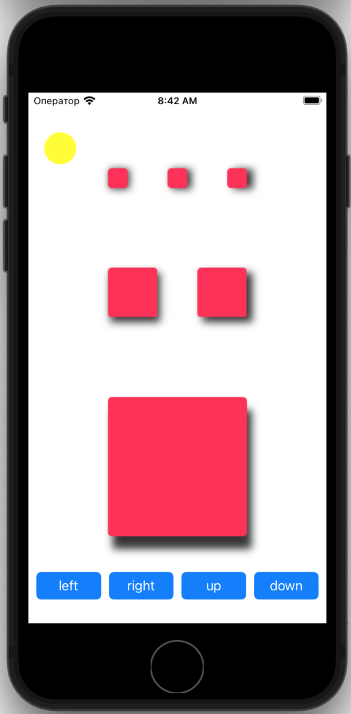

# MyShadow
## Оглавление
- **[Краткое описание](#Basic)**
- **[Презентация](#Presentation)**
- **[Задание](#Task)**

## Краткое описание
- Проект написан на **UIKit**
- Использована архитеутра **MVC**
- Адаптивная верстка интерфейса **кодом**. Проверна на **iPhoneSE (3st generation)**
## Презентация

## Задание
- Необходимо написать приложение, в котором тень от вью будет отбрасываться в зависимости от положения "солнца" на экране с учетом расстояния до этого "солнца".
- При разработке приложения необходимо использовать архитектуру MVC
Язык программирования для реализации тестового задания – Swift 5.3+
